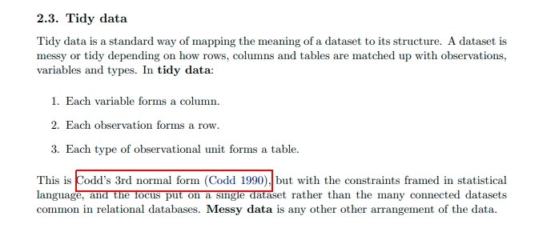

```{css, echo=FALSE}
h1 { padding-top: 50px;}
h2 { padding-top: 40px;}
h3 { padding-top: 30px;}
h4 { padding-top:20px;}
```


```{r setup, echo = F}
knitr::opts_knit$set(root.dir = rprojroot::find_rstudio_root_file())
```

```{r, eval=F, echo = F, include=F}
if(F){
  # Intentando que aparezca sintaxis de SQL en html_notebook
  cat(paste0("<style>", xfun::file_string("./assets/default.css"), "</style>"))  
  cat(paste0("<script>", xfun::file_string("./assets/highlight.pack.js"), "</script>"))
}

```


### Algunas buenas prácticas de software

- DotEnv: convencion de usar un archivo .env para guardar contraseñas, usuarios y otra información sensible. Este archivo no debe ser commiteado a Github (poner .env en .gitignore). ¿Por qué? Seguridad

- [renv](https://rstudio.github.io/renv/): *R*eproducible *Env*ironments. Similar a pip y requirements.txt en Python. ¿Por qué? Reproducibilidad. Para instalar los paquetes, inicien Rstudio, un nuevo proyecto y usen `renv::restore()`


```{r, warnings=F, message=F}
library(readr)
library(readxl)
library(curl)
library(dplyr)
library(dbplyr)
library(RPostgreSQL)
library(DBI)
library(dotenv)
library(bit64)
library(ggplot2)
library(plotly)
```


# 0. Cargando data en local y DB

Esta parte ha sido corrida para crear la base de datos.

Primero, descargamos datos abiertos del OSCE.
```{r}
read_write_conosce_data <- function(url, name){
    dir.create("data")
    fullpath <- paste0("./data/", name)
    
    if (file.exists(fullpath)){
        cat("reading from file")
        data <- read_csv(fullpath)
    }else{
        tf = tempfile(fileext = ".xlsx")
        curl_download(url, tf)
        data <- read_excel(tf)
        write_csv(data, fullpath)        
    }
    
    return(data)
}

contratos <- read_write_conosce_data("http://conosce.osce.gob.pe/assets/67ae6c4a/reportes/contratos/2020/CONOSCE_CONTRATOS2020_0.xlsx", "contratos_2020.csv")
adjudicaciones <- read_write_conosce_data("http://conosce.osce.gob.pe/assets/67ae6c4a/reportes/adjudicaciones/2020/CONOSCE_ADJUDICACIONES2020_0.xlsx", "adjudicaciones_2020.csv")

```


El archivo .env que les he compartido debe estar en la raiz del proyecto. La libreria dotenv lo leerá desde ahí. Usamos librerías de R que nos dan una interfaz para conectarse e interactuar con la BD.
```{r}
dotenv::load_dot_env(".env")
pg <-  DBI::dbDriver("PostgreSQL")
con <-RPostgreSQL::dbConnect(
    pg,
    user = Sys.getenv("USER"),
    password= Sys.getenv("PASSWORD"),
    host =Sys.getenv("HOST"),
    port =Sys.getenv("PORT"),
    dbname = Sys.getenv("DBNAME")
)
```


### Copiando datos a base de datos

El listado de las tablas
```{r}
DBI::dbListTables(con)
```

Copiando uno de los tibbles/dataframes a la base de datos
```{r, eval=F}
dplyr::copy_to(
  con,
  contratos,
  name = "conosce_contratos_v1",
  overwrite = FALSE,
  temporary = FALSE,
  analyze = TRUE,
  in_transaction = TRUE
)
```


El output de esta operación desde la consola de la BD. Vemos el nombre de las columans y el tipo de dato. 

R tiene tipos como integer `1L`, numeric `1.4`, character `"hola"`, logical `T`, etc. La base de datos manejan tipos análogos. 
```
bbsfunes=> \d conosce_contratos_v1
                              Table "public.conosce_contratos"
             Column             |           Type           | Collation | Nullable | Default 
--------------------------------+--------------------------+-----------+----------+---------
 CODIGOCONVOCATORIA             | double precision         |           |          | 
 N_COD_CONTRATO                 | double precision         |           |          | 
 DESCRIPCION_PROCESO            | text                     |           |          | 
 FECHA_PUBLICACION_CONTRATO     | timestamp with time zone |           |          | 
 FECHA_SUSCRIPCION_CONTRATO     | timestamp with time zone |           |          | 
 FECHA_VIGENCIA_INICIAL         | timestamp with time zone |           |          | 
 FECHA_VIGENCIA_FINAL           | timestamp with time zone |           |          | 
 FECHA_VIGENCIA_FIN_ACTUALIZADA | timestamp with time zone |           |          | 
 CODIGO_CONTRATO                | text                     |           |          | 
 NUM_CONTRATO                   | text                     |           |          | 
 MONTO_CONTRATADO_TOTAL         | double precision         |           |          | 
 MONTO_CONTRATADO_ITEM          | double precision         |           |          | 
 MONTO_ADICIONAL                | double precision         |           |          | 
 MONTO_REDUCCION                | double precision         |           |          | 
 MONTO_PRORROGA                 | double precision         |           |          | 
 MONTO_COMPLEMENTARIO           | double precision         |           |          | 
 URLCONTRATO                    | text                     |           |          | 
 CODIGOENTIDAD                  | text                     |           |          | 
 NUM_ITEM                       | double precision         |           |          | 
 MONEDA                         | text                     |           |          | 
 RUC_CONTRATISTA                | text                     |           |          | 
 RUC_DESTINATARIO_PAGO          | text                     |           |          | 
 TIENERESOLUCION                | text                     |           |          | 

```


### Tipos de datos en Postgresql

```{r, eval=F}
tipos <- c("integer", "integer", "text", rep("timestamptz", 5), "text", "text", rep("float", 6), "text", "text", "integer", rep("text", 4))
names(tipos) <- colnames(contratos)

dplyr::copy_to(
  con,
  contratos,
  types = tipos,
  name = "conosce_contratos_v2",
  temporary = FALSE,
  overwrite=T,
  analyze = TRUE,
  in_transaction = FALSE
)
```


```
bbsfunes=> \d conosce_contratos
                              Table "public.conosce_contratos"
             Column             |           Type           | Collation | Nullable | Default 
--------------------------------+--------------------------+-----------+----------+---------
 CODIGOCONVOCATORIA             | integer                  |           |          | 
 N_COD_CONTRATO                 | integer                  |           |          | 
 DESCRIPCION_PROCESO            | text                     |           |          | 
 FECHA_PUBLICACION_CONTRATO     | timestamp with time zone |           |          | 
 FECHA_SUSCRIPCION_CONTRATO     | timestamp with time zone |           |          | 
 FECHA_VIGENCIA_INICIAL         | timestamp with time zone |           |          | 
 FECHA_VIGENCIA_FINAL           | timestamp with time zone |           |          | 
 FECHA_VIGENCIA_FIN_ACTUALIZADA | timestamp with time zone |           |          | 
 CODIGO_CONTRATO                | text                     |           |          | 
 NUM_CONTRATO                   | text                     |           |          | 
 MONTO_CONTRATADO_TOTAL         | double precision         |           |          | 
 MONTO_CONTRATADO_ITEM          | double precision         |           |          | 
 MONTO_ADICIONAL                | double precision         |           |          | 
 MONTO_REDUCCION                | double precision         |           |          | 
 MONTO_PRORROGA                 | double precision         |           |          | 
 MONTO_COMPLEMENTARIO           | double precision         |           |          | 
 URLCONTRATO                    | text                     |           |          | 
 CODIGOENTIDAD                  | text                     |           |          | 
 NUM_ITEM                       | integer                  |           |          | 
 MONEDA                         | text                     |           |          | 
 RUC_CONTRATISTA                | text                     |           |          | 
 RUC_DESTINATARIO_PAGO          | text                     |           |          | 
 TIENERESOLUCION                | text                     |           |          | 
```

¿Por qué podria ser importante asignar el tipo adecuado de dato? Un RUC podríamos representarlo como texto o numérico.

- velocidad de operación: comparar strings vs comparar enteros

- cantidad de información: timestamp vs timestamptz vs date

- espacio ocupado: date [4bytes], timestamptz [8bytes], integer[4bytes], bigint [bytes], double [8bytes]

- [Garantia de integridad de los datos](https://en.wikipedia.org/wiki/ACID)

Si lo haces bien: velocidad, ahorro de espacio, datos representativos. ¿Cuando importa? Cuando tienes mucha data o recursos limitados.


Preguntas: 

- ¿cual es la unidad estadística de los datos? 

- ¿por qué R ha cargado el RUC_CONTRATISTA como texto?

Para modelar bien datos hay que explorarlos primero, entender el proceso que los generó, entender los valores posibles que pueden tomar, y como se asocian entre ellos.

A este análisis se le llama [modelamiento entidad-relacion](https://en.wikipedia.org/wiki/Entity%E2%80%93relationship_model) y [normalización](https://en.wikipedia.org/wiki/Database_normalization). Aunque los términos pueden sonar extraños si no se ha leído sobre bases de datos, son los principios detrás del concepto de **tidy data** del que saca su nombre el `tidyverse`. Ver [Tidy Data](https://vita.had.co.nz/papers/tidy-data.pdf) de Hadley Wickham, el diseñador del `tidyverse`.



Una version "ideal", de nuestros datos, escrita en SQL. 

```{sql, eval=F}
CREATE TABLE conosce_contratos(
    -- se podria hacer una PRIMARY KEY compuesta a partir de NUM_ITEM Y N_COD_CONTRATO,
    id SERIAL PRIMARY KEY,  
    
    -- foreign key:  hace referencia a otra tabla
    -- si es NOT NULL, no puede existir un contrato sin referencia a un proceso de seleccion adjudicado
    CODIGOCONVOCATORIA INTEGER NOT NULL REFERENCES conosce_adjudicaciones(CODIGOCONVOCATORIA),
    
    N_COD_CONTRATO INTEGER NOT NULL,
    DESCRIPCION_PROCESO TEXT NOT NULL,
    FECHA_PUBLICACION_CONTRATO DATE NOT NULL
    
    -- ETC, ...
    
    -- diferencia importante, pero necesitas conocimiento del dominio
    -- los datos estan "sucios" desde su nomenclatura
    RUC_CONTRATISTA BIGINT,
    
    -- de tener los datos completos, esto seria otra tabla
    --RUC_CONTRATISTA BIGINT REFERENCES empresas(RUC),
    
    RNP_CONTRATISTA TEXT NOT NULL
);

-- Indices en Foreign Keys, importante para acelerar busquedas e insertar datos
CREATE INDEX idx_ruc_conosce_contratos ON conosce_contratos(RUC_CONTRATISTA) ;
CREATE INDEX idx_CODIGOCONVOCATORIA_conosce_contratos ON conosce_contratos(CODIGOCONVOCATORIA) ;
```


Ya que estamos en solo un ejemplo, insertaremos estos datos a la BD sin llaves ni constraints.

```{r, eval=F}
contratos %>% 
    mutate(ruc = as.integer64(RUC_CONTRATISTA)) %>% 
    dplyr::copy_to(
      con,
      .,
      types = c(tipos, c("ruc"="bigint")),
      name = "conosce_contratos",
      indexes = list("ruc", "CODIGOCONVOCATORIA", "N_COD_CONTRATO"),
      temporary = FALSE,
      overwrite=T,
      analyze = TRUE,
      in_transaction = FALSE
    )


adjudicaciones_types <- c(
    "text", "bigint", "int", "text", "int", "text", "text", rep("float",3), rep("text", 5), rep("timestamptz", 3)
)
names(adjudicaciones_types) <- colnames(adjudicaciones)


adjudicaciones %>% 
    mutate(ruc= as.integer64(RUC_PROVEEDOR)) %>% 
    dplyr::copy_to(
      con,
      .,
      name = "conosce_adjudicaciones",
      types = c(adjudicaciones_types,     "ruc"="bigint"),
      indexes = list("ENTIDAD_RUC", "CODIGOCONVOCATORIA", "ruc"),
      overwrite = FALSE,
      temporary = FALSE,
      analyze = TRUE,
      in_transaction = FALSE
    )
```


### Inspeccionando tablas en base de datos

```{r}
tbl(con, "conosce_contratos" ) %>% head(1)
```

```{r}
tbl(con, "conosce_adjudicaciones" ) %>% head(1)
```

# 1. Integrando datos y computando indicadores

Para analizar rápido los datos, vamos a obviar:
  - conversión de monedas
  - tomar en cuenta adicionales, reducciones, etc
  

```{r}
contrato <- 
  contratos %>% 
  group_by(RUC_CONTRATISTA, N_COD_CONTRATO) %>% 
  summarise(
    monto_total = sum(MONTO_CONTRATADO_ITEM),
    l = length(unique(MONTO_CONTRATADO_TOTAL)),
    MONTO_CONTRATADO_TOTAL = unique(MONTO_CONTRATADO_TOTAL)[1]
  ) %>% 
  ungroup() %>% 
  
  inner_join(
    distinct(contratos, RUC_CONTRATISTA, N_COD_CONTRATO, CODIGOENTIDAD),
    by = c("RUC_CONTRATISTA", "N_COD_CONTRATO")
  )
```

Validar: ¿monto_contratado_total es igual al computado sumando items?


Ahora, haciendo las mismas operaciones con dbplyr

```{r}
contrato_dbplyr <- 
  tbl(con, "conosce_contratos") %>% 
  
  group_by(RUC_CONTRATISTA, N_COD_CONTRATO) %>% 
  summarise(
    monto_total = sum(MONTO_CONTRATADO_ITEM),
    # l = length(unique(MONTO_CONTRATADO_TOTAL)),
    # MONTO_CONTRATADO_TOTAL = unique(MONTO_CONTRATADO_TOTAL)[1]
  ) %>% 
  ungroup() %>% 
  
  inner_join(
    distinct(tbl(con, "conosce_contratos"), RUC_CONTRATISTA, N_COD_CONTRATO, CODIGOENTIDAD),
    by = c("RUC_CONTRATISTA", "N_COD_CONTRATO")
  ) %>% 
  # NOTE: Nuevo
  collect()
```

Notar que:

- No soporta algunas operaciones
- Todo el procesamiento lo hace en el servidor. Util si no se necesita todo el detalle de los datos o no se tiene memoria).
- Sintaxis es exactamente la misma! 


### [Traduccion a SQL](https://dbplyr.tidyverse.org/articles/sql-translation.html)

Detrás de escenas, `dbplyr` traduce el codigo `dplyr` a SQL
```{r}
query <- 
  tbl(con, "conosce_contratos") %>% 
  
  group_by(RUC_CONTRATISTA, N_COD_CONTRATO) %>% 
  summarise(
    monto_total = sum(MONTO_CONTRATADO_ITEM),
    # l = length(unique(MONTO_CONTRATADO_TOTAL)),
    # MONTO_CONTRATADO_TOTAL = unique(MONTO_CONTRATADO_TOTAL)[1]
  ) %>%
  
  inner_join(
    distinct(tbl(con, "conosce_contratos"), RUC_CONTRATISTA, N_COD_CONTRATO, CODIGOENTIDAD),
    by = c("RUC_CONTRATISTA", "N_COD_CONTRATO")
  ) 
```


```{r}
class(query)
```
¿A que hace referencia `tbl_lazy`?


```{r}
sql_render(query)
```

Dandole un formato mas legible:
```{sql, eval = F, echo = T}
SELECT 
  -- AS es simplemente renombrar el campo
  "LHS"."RUC_CONTRATISTA" AS "RUC_CONTRATISTA",
  "LHS"."N_COD_CONTRATO" AS "N_COD_CONTRATO",
  "monto_total", 
  "CODIGOENTIDAD"
  
FROM (
  -- conocido como un subquery, o un query anidado dentro de otro
  SELECT 
    "RUC_CONTRATISTA", 
    "N_COD_CONTRATO", 
    -- lo que iria dentro de un mutate ya esta considerado aqui
    SUM("MONTO_CONTRATADO_ITEM") AS "monto_total"
  FROM 
    "conosce_contratos"
  GROUP BY 
    "RUC_CONTRATISTA", 
    "N_COD_CONTRATO"
  ) "LHS"

INNER JOIN (
  SELECT 
    DISTINCT "RUC_CONTRATISTA", "N_COD_CONTRATO", "CODIGOENTIDAD"
  FROM 
    "conosce_contratos"
) "RHS"
  ON  (
    "LHS"."RUC_CONTRATISTA" = "RHS"."RUC_CONTRATISTA" AND
    "LHS"."N_COD_CONTRATO" = "RHS"."N_COD_CONTRATO"
)
```


```{r}
dependencia <- 
  contrato %>% 
  group_by(RUC_CONTRATISTA) %>% 
  summarise(
    total_contratista = sum(monto_total),
    n_contratos = n()
  ) %>% 
  inner_join(
    
    contrato %>% 
      group_by(RUC_CONTRATISTA, CODIGOENTIDAD) %>% 
      summarise(
        total_contratista_x_entidad= sum(monto_total)
      ),
    by = "RUC_CONTRATISTA"
  ) %>% 
  mutate(
    proporcion_dependencia = total_contratista_x_entidad/total_contratista
  )
```
¿Qué sería riesgoso o raro de ver?


```{r}
dependencia %>% 
  arrange(desc(n_contratos), desc(proporcion_dependencia)) %>% 
  select(proporcion_dependencia, everything()) %>% 
  mutate(proporcion_dependencia = round(proporcion_dependencia, 2))
```

Un gráfico ayuda a resaltar lo sospechoso.
```{r}
dependencia %>% 
  ggplot() + 
  geom_point(aes(x=n_contratos, y = proporcion_dependencia)) + 
  labs(
    title="Proporción de dependencia de un contratista con una entidad",
    subtitle ="Cada punto es un contratista x una entidad"
  )
```
Un poco de interactividad nos ayudará a inspeccionar los puntos sospechosos.
```{r}
g <- dependencia %>% 
  ggplot() + 
  geom_point(
    aes(x=n_contratos, y = proporcion_dependencia, text = RUC_CONTRATISTA)
  )

plotly::ggplotly(g, tooltip="text", hover_mode="closest")
```

Revisando algunos de los procesos para un RUC sospechoso

20515430769 - CORPORACION AGROPECUARIA BERTHA SOCIEDAD ANONIMA CERRADA

```{r}
filter(contratos, RUC_CONTRATISTA==20515430769) %>% 
  select(DESCRIPCION_PROCESO)
```


# 2. Vistas materializadas

Mañana se subirán 10 contratos nuevos, la próxima semana 100. ¿Se corre este script cada vez que se actualice la data? Porque se necesita usar todos los datos para computar las proporciones. Las bases de datos SQL tienen una estructura llamada Materialized Views, donde se crea una "tabla" a partir de las tablas preexistentes, y se guarda en disco, a diferencia de un query que está solo en memoria y debe recomputarse cada vez que se consulta. Usar Vistas materializadas es un tema ya del área conocida como *Data Warehousing*, donde el énfasis está en el análisis de los datos, una vez garantizada la estabilidad y validez de la *base* de datos.

```{sql, eval=F}
CREATE MATERIALIZED VIEW funes_proporcion_dependencia
AS
WITH monto_total_x_contratista AS (
  SELECT 
    "RUC_CONTRATISTA", 
    SUM("MONTO_CONTRATADO_ITEM") AS "monto_total",
    COUNT(DISTINCT("N_COD_CONTRATO")) AS "n_contratos"
  FROM 
    "conosce_contratos"
  GROUP BY 
    "RUC_CONTRATISTA"
), 

  monto_total_contratista_x_entidad AS (
  SELECT 
    "RUC_CONTRATISTA", 
    SUM("MONTO_CONTRATADO_ITEM") as "total_x_entidad",
    "CODIGOENTIDAD"
  FROM 
    "conosce_contratos"
  GROUP BY 
    "RUC_CONTRATISTA", 
    "CODIGOENTIDAD"
)
SELECT
  monto_total_contratista_x_entidad."total_x_entidad" / monto_total_x_contratista."monto_total" AS proporcion_dependencia,
  "RUC_CONTRATISTA",
  "CODIGOENTIDAD",
  n_contratos,
  monto_total
FROM 
  monto_total_contratista_x_entidad
INNER JOIN
  monto_total_x_contratista 
    USING("RUC_CONTRATISTA")
ORDER BY
  n_contratos DESC,
  proporcion_dependencia DESC
;

  
)
```

```{r}
tbl(con, "funes_proporcion_dependencia") %>% head()
```


### Actualización y ahorro en computación

Las vistas materializadas se pueden actualizar con el comando:
```{sql}
REFRESH MATERIALIZED VIEW funes_proporcion_dependencia
```

Esto recomputa todo el query y lo almacena bajo el mismo nombre.

Ya que la vista es función de ciertas columnas de ciertas tablas, y, posiblemente, de ciertas filas en estas; podría ser que no necesitemos recomputar *todo* el query, sino solo en aquellos lugares donde ha cambiado. Algunas bases de datos como Amazon [Redshift](https://docs.aws.amazon.com/redshift/latest/dg/materialized-view-refresh-sql-command.html) ya lo tienen. En PostgreSQL está en [proyecto](https://wiki.postgresql.org/wiki/Incremental_View_Maintenance). El keyword a usar para estas sería `INCREMENTALLY`


# 3. Bonus - Window functions en SQL

Usar un pipeline `group_by() %>% mutate() %>% ungroup()` y traducirlo a SQL. 

Necesitamos usar esto cuando queremos calcular los indicadores de riesgo de la red contratista - funcionario. El tiempo de duración y dinero contratado se va acumulando, e importa el orden. Queremos computar un valor para cada instante del tiempo. A esto se le conoce como `window function.`

