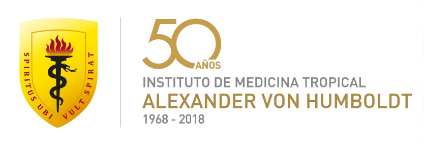

# LIS_brownbag

Repositorio de las sesiones del "Brown bag series" del [Laboratorio de Innovación en Salud](https://investigacion.cayetano.edu.pe/catalogo/biotecnologia/innov-lab) del Instituto de Medicina Tropical "Alezander von Humboldt" - Universidad Peruana Cayetano Heredia.

  

  

----

## [Sesion 06](https://github.com/healthinnovation/LIS_brownbag/tree/master/01_BBS_sesion06)

**Tema:** Una rápida introducción a los modelos CMIP6

**Ponente:** [Juan Bazo](https://twitter.com/francho3)

**Fecha:** Jul 10, 2021

## [Sesion 04](https://github.com/JorgeGalindo/excessmortality/)

**Tema:** Visualización de datos para la toma de decisiones en políticas públicas durante la pandemia

**Ponente**: [Jorge Galindo](https://twitter.com/JorgeGalindo)

**Fecha:** Feb 27, 2021

## [Sesion 03](https://github.com/healthinnovation/LIS_brownbag/tree/master/01_BBS_sesion03)

**Tema:** FUNES: Modelo de estimación de riesgo de corrupción en contrataciones públicas

**Ponente**: [Gianfranco Rossi](https://twitter.com/gjrossir)

**Fecha:** Dic 12, 2020

## [Sesion 02](https://github.com/healthinnovation/LIS_brownbag/tree/master/01_BBS_sesion02)

**Tema:** Organización y Reproducibilidad en tiempos de pandemia

**Ponente:** [José Incio](https://twitter.com/jlincio)

**Fecha:** Nov 14, 2020

## [Sesion 01](https://github.com/healthinnovation/LIS_brownbag/tree/master/01_BBS_sesion01)

**Tema:** Análisis de múltiples epidemias y prevalencias con R y purrr

**Ponente:** [Andree Valle](https://twitter.com/avallecam)

**Fecha:** Oct 10, 2020
